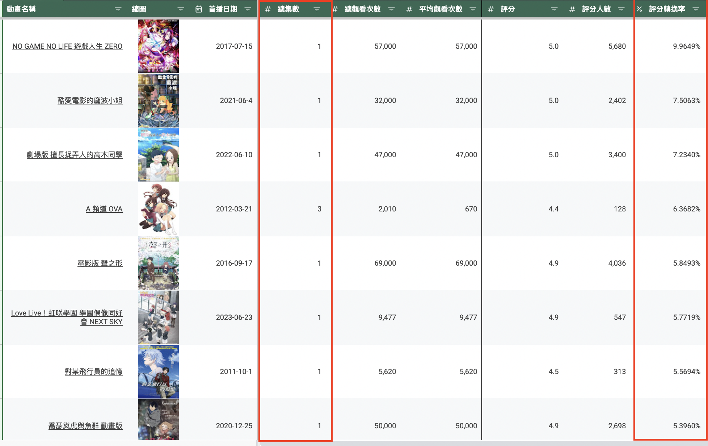
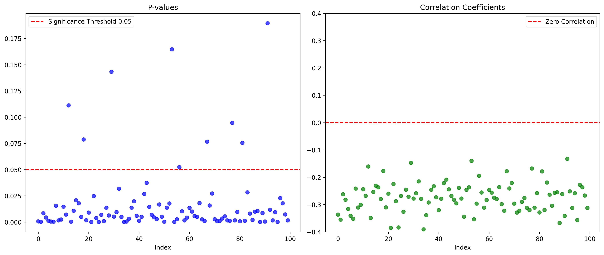

# Animation Crazy Analysis

Animation Crazy ([巴哈姆特動畫瘋](https://ani.gamer.com.tw/)) is one of the most popular Japanese animation streaming platforms in Taiwan.  
As a frequent user, I built this project to crawl anime viewing data and utilize this information to develop functionalities like review analysis and anime recommendations.  
The results can be viewed in this [Google Sheet](https://docs.google.com/spreadsheets/d/1F94CV-TTa628TumABt3DOF_beqJxQTJ-Mjp1nHkWQDE/edit?usp=sharing).

**Disclaimer:**  
This project is developed purely out of personal interest and is not intended for commercial use.

---

## Contents 
- [Web Crawler](#webCrawler)
  1. [Anime-level Data](#animeLevel)
  2. [Episode-level Data](#episodeLevel)
- [Exploratory Data Analysis](#eda)
  1. [Viewers Are More Likely to Score Fewer-Episode Anime](#scoreRateObserve)
- [Extra Functionalities](#functions)
  1. [Review Analysis](#reviewAnalysis)
  2. [Recommendation System](#recommendation)
- [Google Sheet Development](#googleSheet)

---

## Web Crawler 
Details of the implementation can be found in the `data.py` script in the `modules` folder.

### i. Anime-level Data 

All authorized animations can be found on the "All Anime List" ([所有動畫](https://ani.gamer.com.tw/animeList.php)) tab of the Animation Crazy website.  

    

As shown in the screenshot, we can extract information such as `total views`, `total episodes`, etc. Additionally, by clicking on an individual anime, more detailed metrics like `launch date`, `score`, and more can be retrieved.  

This information is collected using static web scraping techniques (`requests` and `BeautifulSoup`) and stored in the **Anime-Level Data** tab of the [Google Sheet](https://docs.google.com/spreadsheets/d/1F94CV-TTa628TumABt3DOF_beqJxQTJ-Mjp1nHkWQDE/edit?usp=sharing). Below is a brief explanation of each column:

| **Column**   | **Explanation**                                                                                          |
|--------------|----------------------------------------------------------------------------------------------------------|
| 動畫名稱       | The name of the animation.                                                                               |
| 縮圖         | The thumbnail of the animation.                                                                          |
| 首播日期       | The premiere date of the animation.                                                                      |
| 總集數        | The total number of episodes.                                                                            |
| 總觀看次數      | The total view count.                                                                                    |
| 平均觀看次數     | The average view count per episode (`total views / total episodes`).                                     |
| 評分         | The overall rating of the animation.                                                                     |
| 評分人數       | The total number of ratings.                                                                             |
| 評分轉換率      | Scoring conversion rate (`total scorings / total views`): measures the tendency to score after watching. |
| 原作者        | The author of the original work.                                                                         |
| 代理商        | The licensing agency.                                                                                    |
| 動畫公司       | The production company of the animation.                                                                 |
| 導演         | The director of the animation.                                                                           |
| 類型         | The genres of the animation.                                                                             |
| 簡介         | A brief description of the animation.                                                                    |

[Back to Contents](#contents)

---

### ii. Episode-level Data 
Each episode of an anime also includes metrics such as `view count`, `danmu count` (彈幕數), `comment count`, and more.  

  

As shown above, the `danmu count` is located within a scrolldown element. To retrieve this information, dynamic web scraping techniques using `selenium` are required. 
The results are stored in the **Episode-Level Data** tab of the [Google Sheet](https://docs.google.com/spreadsheets/d/1F94CV-TTa628TumABt3DOF_beqJxQTJ-Mjp1nHkWQDE/edit?usp=sharing). Below is a brief explanation of each column:

| **Column**   | **Explanation**                                                                 |
|--------------|---------------------------------------------------------------------------------|
| 動畫名稱       | The name of the animation.                                                     |
| 集數         | The episode name.                                                              |
| 上架時間       | The upload time of the episode.                                               |
| 觀看數        | The view count of the episode.                                                |
| 評論數        | The comment count of the episode.                                             |
| 評論轉換率      | Comment conversion rate (`comments / views`): measures the tendency to comment after watching. |
| 彈幕數        | The number of danmu (user-generated subtitles/comments overlaid on the video). |
| 彈幕轉換率      | Danmu conversion rate (`danmu / views`): measures the tendency to send danmu while watching. |

[Back to Contents](#contents)

---
## Exploratory Data Analysis 
After scraping data from the [Animation Crazy](https://ani.gamer.com.tw/) website, I conducted some exploratory data analysis (EDA) to gain insights from the data.

### i. Viewers Are More Likely to Score Fewer-Episode Anime  
When I sorted the animations by the scoring conversion rate (`total scorings / total views`) in descending order, I noticed that the top-rated animations were not necessarily the most popular ones, but rather those with fewer episodes. This led me to an interesting question: Are shorter anime more likely to trigger viewers to rate?

Intuitively, this makes sense: viewers are more likely to leave a rating after finishing the entire anime, and this process is easier with a fewer-episode anime. However, I wanted to confirm this assumption with statistical analysis.

First, I calculated the correlation coefficient between `total episodes` and `scoring rate`, which came out to be around `-20%`. To further investigate whether this negative correlation is statistically significant, I built a regression model with `scoring rate` as the response variable and `total episodes` as the predictor.

Although the P-value is quite small, the large number of observations (animations) relative to the number of parameters might make the result seem significant simply because of the sample size. To test this, I designed an experiment: I randomly selected 100 animations and built regression models based on their `scoring rate` and `total episodes`. I recorded the P-value and correlation coefficient for each model. This process was repeated 100 times, and the results are shown below:

As shown in the plots above, all experiments demonstrated a negative correlation between `scoring rate` and `total episodes`, with most results being statistically significant. Therefore, I can conclude that viewers are more likely to score anime with fewer episodes.

[Back to Contents](#contents)

---

## Extra Functionalities 
Using the data scraped from [Animation Crazy](https://ani.gamer.com.tw/) webpages, I developed two core functionalities and implemented them as API endpoints using `FastAPI`. 
The implementation details can be found in the `api.py`, `review_analysis.py`, and `recommend.py` scripts within the `modules` folder.

### i. Review Analysis 
Each episode includes comments and danmus. To gain insights into the overall audience sentiment, I created a functionality that analyzes these reviews through word frequency analysis. The process is as follows:

1. Users select a specific episode of their chosen animation.
2. The application dynamically scrapes all comments and danmus for that episode.
3. Reviews are segmented using `Jieba`, with stop words removed.
4. The top 20 most frequent words are identified and displayed.

This functionality can be accessed through the **Episode Trend Analysis** tab in the [Google Sheet](https://docs.google.com/spreadsheets/d/1F94CV-TTa628TumABt3DOF_beqJxQTJ-Mjp1nHkWQDE/edit?usp=sharing).

### Example: Attack on Titan - Spoiler Alert!  
In the **Episode Trend Analysis** tab, users can select their preferred anime to view both numeric trends and a chart displaying episode performance. 
To analyze reviews for a specific episode, users must select the episode and press the designated button to trigger the review analysis.

Below is an example of a review analysis for a selected episode:  

During my first run of this analysis, I noticed that **o7** (a text-based emoji representing a salute 🫡) was the most frequent word in the danmus. 
This reminded me of the scene where Hange (漢吉) sacrifices herself to buy time for the flying boat. Many viewers expressed their respect by flooding the danmus with **o7**. 
It was incredibly satisfying to see how this functionality captured that emotional moment for me.  

**Observations:**  
The review analysis functionality works exceptionally well for capturing trends in danmus, which are typically short and repetitive, making word frequency analysis highly effective. 
However, it performs less effectively for analyzing comments, as they are often longer and more diverse in structure, requiring more advanced techniques to capture their essence.

[Back to Contents](#contents)

---

### ii. Recommendation System 

#### Anime Types Similarity

#### Anime Introduction Similarity

#### Extra Features

#### Decision Formula

[Back to Contents](#contents)

---

## Google Sheet Development 

[Back to Contents](#contents)