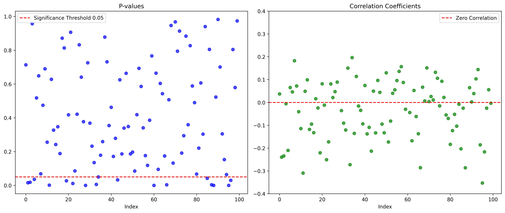
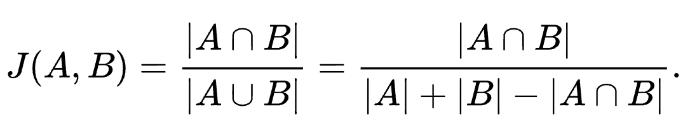

# Animation Crazy Analysis

Animation Crazy ([巴哈姆特動畫瘋](https://ani.gamer.com.tw/)) is one of the most popular Japanese animation streaming
platforms in Taiwan.  
As a frequent user, I built this project to crawl anime viewing data and utilize this information to develop
functionalities like review analysis and anime recommendations.  
The results can be viewed in
this [Google Sheet](https://docs.google.com/spreadsheets/d/1F94CV-TTa628TumABt3DOF_beqJxQTJ-Mjp1nHkWQDE/edit?usp=sharing).

**Disclaimer:**  
This project is developed purely out of personal interest and is not intended for commercial use.

---

# Contents 

- [Web Crawler](#webCrawler)
    1. [Anime-level Data](#animeLevel)
    2. [Episode-level Data](#episodeLevel)
- [Exploratory Data Analysis](#eda)
    1. [Viewers Are More Likely to Score Fewer-Episode Animations?](#scoreRateObserve)
    2. [Viewers Are More Likely to Comment on Bad Animations?](#commentRateObserve)
- [Extra Functionalities](#functions)
    1. [Review Analysis](#reviewAnalysis)
    2. [Recommendation System](#recommendation)
- [Google Sheet Development](#googleSheet)
- [References](#ref)

---

# Web Crawler 

Details of the implementation can be found in the `data.py` script in the `modules` folder.

## i. Anime-level Data 

All authorized animations can be found on the "All Anime List" ([所有動畫](https://ani.gamer.com.tw/animeList.php)) tab
of the Animation Crazy website.

As shown in the screenshot, we can extract information such as `total views`, `total episodes`, etc. Additionally, by
clicking on an individual anime, more detailed metrics like `launch date`, `score`, and more can be retrieved.

This information is collected using static web scraping techniques (`requests` and `BeautifulSoup`) and stored in the *
*Anime-Level Data** tab of
the [Google Sheet](https://docs.google.com/spreadsheets/d/1F94CV-TTa628TumABt3DOF_beqJxQTJ-Mjp1nHkWQDE/edit?usp=sharing).
Below is a brief explanation of each column:

| **Column** | **Explanation**                                                                                          |
|------------|----------------------------------------------------------------------------------------------------------|
| 動畫名稱       | The name of the animation.                                                                               |
| 縮圖         | The thumbnail of the animation.                                                                          |
| 首播日期       | The premiere date of the animation.                                                                      |
| 總集數        | The total number of episodes.                                                                            |
| 總觀看次數      | The total view count.                                                                                    |
| 平均觀看次數     | The average view count per episode (`total views / total episodes`).                                     |
| 評分         | The overall rating of the animation.                                                                     |
| 評分人數       | The total number of ratings.                                                                             |
| 評分轉換率      | Scoring conversion rate (`total scorings / total views`): measures the tendency to score after watching. |
| 原作者        | The author of the original work.                                                                         |
| 代理商        | The licensing agency.                                                                                    |
| 動畫公司       | The production company of the animation.                                                                 |
| 導演         | The director of the animation.                                                                           |
| 類型         | The genres of the animation.                                                                             |
| 簡介         | A brief description of the animation.                                                                    |

[Back to Contents](#contents)

---

## ii. Episode-level Data 

Each episode of an anime also includes metrics such as `view count`, `danmu count` (彈幕數), `comment count`, and more.

As shown above, the `danmu count` is located within a scrolldown element. To retrieve this information, dynamic web
scraping techniques using `selenium` are required.
The results are stored in the **Episode-Level Data** tab of
the [Google Sheet](https://docs.google.com/spreadsheets/d/1F94CV-TTa628TumABt3DOF_beqJxQTJ-Mjp1nHkWQDE/edit?usp=sharing).
Below is a brief explanation of each column:

| **Column** | **Explanation**                                                                                |
|------------|------------------------------------------------------------------------------------------------|
| 動畫名稱       | The name of the animation.                                                                     |
| 集數         | The episode name.                                                                              |
| 上架時間       | The upload time of the episode.                                                                |
| 觀看數        | The view count of the episode.                                                                 |
| 評論數        | The comment count of the episode.                                                              |
| 評論轉換率      | Comment conversion rate (`comments / views`): measures the tendency to comment after watching. |
| 彈幕數        | The number of danmu (user-generated subtitles/comments overlaid on the video).                 |
| 彈幕轉換率      | Danmu conversion rate (`danmu / views`): measures the tendency to send danmu while watching.   |

[Back to Contents](#contents)

---

# Exploratory Data Analysis 

After scraping data from the [Animation Crazy](https://ani.gamer.com.tw/) website, I conducted some exploratory data
analysis (EDA) to gain insights from the data.
The implementation details can be found in the `eda.py` script within the `modules` folder.

## i. Viewers Are More Likely to Score Fewer-Episode Animations  

When I sorted the animations by the scoring conversion rate (`total scorings / total views`) in descending order, I
noticed that the top-rated animations were not necessarily the most popular ones, but rather those with fewer episodes.
This led me to an interesting question: Are shorter anime more likely to trigger viewers to rate?

Intuitively, this makes sense: viewers are more likely to leave a rating after finishing the entire anime, and this
process is easier with a fewer-episode anime. However, I wanted to confirm this assumption with statistical analysis.

First, I calculated the correlation coefficient between `total episodes` and `scoring rate`, which came out to be
around `-20%`. To further investigate whether this negative correlation is statistically significant, I built a
regression model with `scoring rate` as the response variable and `total episodes` as the predictor.

Although the P-value is quite small, the large number of observations (animations) relative to the number of parameters
might make the result seem significant simply because of the sample size. To test this, I designed an experiment: I
randomly selected 100 animations and built regression models based on their `scoring rate` and `total episodes`. I
recorded the P-value and correlation coefficient for each model. This process was repeated 100 times, and the results
are shown below:

As shown in the plots above, all experiments demonstrated a negative correlation between `scoring rate`
and `total episodes`, with most results being statistically significant. Therefore, I can conclude that viewers are more
likely to score anime with fewer episodes.

[Back to Contents](#contents)

---

## ii. Viewers Are More Likely to Comment on Bad Animations 

In this analysis, I sorted episodes by their comment conversion rate (`comments / views`) in descending order. I noticed
that an anime called **極速星舞** (HIGHSPEED Etoile) had several episodes with a surprisingly high commenting rate
compared to other animations.

However, **極速星舞** is not a famous anime at all. I was curious about why viewers of this anime were so willing to
leave comments. Then I discovered that the anime's score was only 1.5 out of 5, one of the lowest scores on Animation
Crazy.

This led me to another assumption: Do viewers tend to leave comments when they watch a bad anime?

To verify this, I used `commenting rate` as the response variable and `score` as the predictor to check if there's a
significant negative relationship between the two.

The experiment method is similar to the previous one, but this time, I used `commenting rate` and `score` as variables.
The P-value and correlation results are shown in the following plot:

Unlike the previous experiment, only a small proportion of the experiments showed significant results, and the
correlation coefficients appeared random.

While the comments for **極速星舞** mainly criticize it as a bad animation, this behavior seems to be a special case,
rather than a general trend for all low-rated animations. Therefore, I conclude that viewers are not necessarily more
likely to leave comments for all poorly-rated anime, but rather, this is specific to **極速星舞**.

[Back to Contents](#contents)

---

# Extra Functionalities 

Using the data scraped from [Animation Crazy](https://ani.gamer.com.tw/) webpages, I developed two core functionalities
and implemented them as API endpoints using `FastAPI`.
The implementation details can be found in the `api.py`, `review_analysis.py`, and `recommend.py` scripts within
the `modules` folder.

## i. Review Analysis 

Each episode has comments and danmus. To better understand the overall sentiment of the audience, I developed a feature that analyzes these reviews through word frequency analysis. Here's how it works:

1. Users select a specific episode from their chosen animation.  
2. The application scrapes all comments and danmus for that episode.  
3. Reviews are processed using `Jieba`, with stop words removed.  
4. The top 20 most frequent words are identified and displayed.

This functionality is available in the **Episode Trend Analysis** tab in the [spreadsheet](https://docs.google.com/spreadsheets/d/1F94CV-TTa628TumABt3DOF_beqJxQTJ-Mjp1nHkWQDE/edit?usp=sharing).

### Example: Attack on Titan - Spoiler Alert!

Let's use the finale of **Attack on Titan (進擊的巨人)** as an example to explore the insights we can gain from its reviews.

The images above show the word frequency analysis for the episode's danmus and comments.

During the first run of this analysis, I found that **o7** (a text-based emoji representing a salute 🫡) was the most frequent word in the danmus. This reminded me of the emotional moment when Hange (漢吉) sacrifices herself to buy time for the flying boat. Many viewers expressed their respect by flooding the danmus with **o7**. It was rewarding to see how this feature captured that emotional moment.

**Observations:**  
The review analysis functionality works exceptionally well for capturing trends in danmus, which are typically short and
repetitive, making word frequency analysis highly effective.
However, it performs less effectively for analyzing comments, as they are often longer and more diverse in structure,
requiring more advanced techniques to capture their essence.

[Back to Contents](#contents)

---

## ii. Recommendation System 
The second feature is the anime recommendation system. This allows users to select their favorite anime and set their preference for recommendations (e.g., prioritize higher scores, popularity, or newer releases). Based on these inputs, the system provides a list of recommended anime.

1. Users select 1 to 3 favorite anime.  
2. Choose preference types:  
   - **Higher Scores First**  
   - **More Popular First**  
   - **Newer Releases First**  
3. The system uses a decision formula to rank and display the top 12 recommended animations.

This feature is available in the **Anime Recommendation** tab of the [Google Sheet](https://docs.google.com/spreadsheets/d/1F94CV-TTa628TumABt3DOF_beqJxQTJ-Mjp1nHkWQDE/edit?usp=sharing).

Below is an explanation of how the decision formula generates recommendations based on user inputs.

---

### Anime Types Similarity
To recommend anime, the system calculates the similarity between each pair of anime based on their types using the **Jaccard Index**.

Consider two anime: **Jujutsu Kaisen (咒術迴戰)** and **Demon Slayer (鬼滅之刃)**.

| **Anime**      | **Types**              |
|----------------|------------------------|
| Jujutsu Kaisen | 動作、奇幻、超能力、校園、血腥暴力、靈異神怪 |
| Demon Slayer   | 動作、冒險、奇幻、血腥暴力          |

Thus, their **Types-Based Similarity Score** is:  

By definition, the **Jaccard Index** ensures that the similarity score will always fall between 0 and 1.

---

### Anime Introduction Similarity
In addition to comparing anime by types, I also analyzed the similarity of anime introductions to measure the connection between two works.

1. Used the `RoBERTa-wwm-ext, Chinese` NLP model to process introductions collected from Animation Crazy.  
2. Extracted the embedding vector of the **CLS token** as the feature vector for each introduction.  
3. Calculated cosine similarity between the feature vectors of each pair of anime.

Since cosine similarity values range between -1 and 1, I used a `MinMaxScaler` to map them into the `[0, 1]` range, resulting in **Intro-Based Similarity Scores**.

---

### Extra Features
Beyond similarity scores, users can customize their recommendations by choosing the following additional features:  
- **Score**  
- **Popularity**  
- **Release Date**  

The chart below shows the original distributions of these features for all animations in Animation Crazy:

- **Score** and **Release Date** have left-skewed distributions.  
- **Popularity** has a right-skewed distribution.  

To make these features more balanced and scaled to `[0, 1]`, I applied the following transformations:  
1. For **Score** and **Release Date**: Standardization → Exponential Transformation → Min-Max Scaling.  
2. For **Popularity**: Natural Log Transformation → Min-Max Scaling.  

The transformed distributions are shown below:

---

### Decision Formula
After calculating similarity scores and transforming extra features, the final decision formula is as follows:

Where:  
1. **Similarity** is the average of the **Types-Based Similarity Score** and the **Intro-Based Similarity Score** between users' selected anime and all others.  
2. **Extra Features** represent the transformed values for `Score`, `Popularity`, or `Release Date` based on the user's preference.  

The top 12 anime with the highest **Main Metric** values are displayed as recommendations.

**Observations:**  
The anime recommendation system I developed works effectively in suggesting similar animations based on users' favorite works. It also allows users to set additional preferences for more accurate recommendations. After transforming the features, the system successfully minimizes the impact of outliers. For example, before the transformations, when users selected **More Popular First**, the system would always recommend **Demon Slayer**, even if their preferred anime types were quite different.

[Back to Contents](#contents)

---

# Google Sheet Development 

[Back to Contents](#contents)

---

# References 

- [Dynamic Web Page Scraping With Python: A Guide to Scrape All Content](https://www.zenrows.com/blog/dynamic-web-pages-scraping-python#what-is-dynamic-website)
- [[Python爬蟲實例] 巴哈姆特 動畫瘋：新手入門基礎網路爬蟲教學](https://blog.jiatool.com/posts/gamer_ani_spider/)
- [Authentication — gspread 6.1.2 documentation](https://docs.gspread.org/en/latest/oauth2.html)
- [Chinese BERT with Whole Word Masking](https://github.com/ymcui/Chinese-BERT-wwm)
- [結巴(jieba)斷詞台灣繁體版本](https://github.com/ldkrsi/jieba-zh_TW)
- [如何使用 Python 製作文字雲](https://tech.havocfuture.tw/blog/python-wordcloud-jieba)
- [Wikipedia - Jaccard index](https://en.wikipedia.org/wiki/Jaccard_index)

[Back to Contents](#contents)

