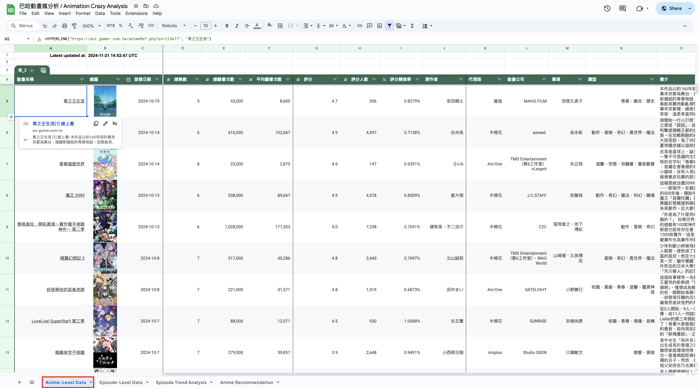

# Animation Crazy Analysis

Animation Crazy ([巴哈姆特動畫瘋](https://ani.gamer.com.tw/)) is one of the most popular Japanese animation streaming
platform in Taiwan.
As a big user of it, I have built this project to crawl some anime viewing data and also utilize these information to
built other functionalities like review analysis and anime recommendation.
The results could be viewed in
the [Google Sheet](https://docs.google.com/spreadsheets/d/1F94CV-TTa628TumABt3DOF_beqJxQTJ-Mjp1nHkWQDE/edit?usp=sharing).

**Disclaimer:**
This project is developed for personal interests, isn't used on any business purposes.

---

## Web Crawler

### 1. Anime-level data

All animations that are authorized could be seen in all anime list ([所有動畫](https://ani.gamer.com.tw/animeList.php)) tab of Animation Crazy website.

As the above screenshot shows, we could scratch anime's `total view`, `total episodes`, ... etc information.
While click into each anime, could also get more detail metrics includes `launched date`, `score`, ... etc.

All these information could be easily scratch through static web crawl methods (`requests` and `BeautifulSoup`) and
results are stored at **Anime-Level Data** tab
of [Google Sheet](https://docs.google.com/spreadsheets/d/1F94CV-TTa628TumABt3DOF_beqJxQTJ-Mjp1nHkWQDE/edit?usp=sharing).

---

## Review Analysis

---

## Recommendation System

---

## APIs

---

## Google Sheet Development